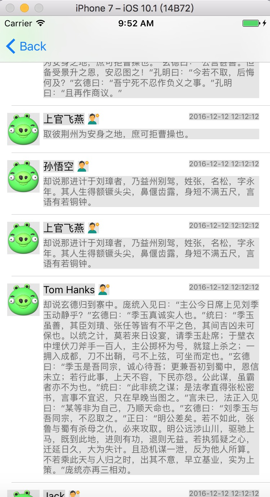

#cell高度自适应，约束优先级对布局的影响
************
**本文为了直观演示，所以用的xib添加约束，当然如果不喜欢xib，那么可以用代码去设置，效果是一样的。**

很多时候cell的高度是不固定的，那么我们经常要计算cell中内容的高度，适当的约束也可以实现自动高度适应，那么这个适当是怎么个概念，话不多说，直接上进入主题。

PS:第一次接触到约束的概念是再大学的时候，学3D设计，位置约束、尺寸约束。我在xib里我也把约束分为这两种，当然个人理解，个人理解

#####**大家都知道下面这个参数**#####
```
UIKIT_EXTERN const CGFloat UITableViewAutomaticDimension NS_AVAILABLE_IOS(5_0);
```
以及如下的方法
```
- (CGFloat)tableView:(UITableView *)tableView estimatedHeightForRowAtIndexPath:(NSIndexPath *)indexPath NS_AVAILABLE_IOS(7_0);
```
本文中它们两个将会用到。

看下图



***

###我们挨个控件添加一下约束
*****
**头像imageView:**
距离左、上10，宽高45


*****

**名字label:**
名字后面因为有性别的图片，所以不去指定label的宽度，这样label的宽度会自适应文字的长度，便于性别图片的位置自适应。
姓名跟头像的顶部对齐，左侧距离头像5，高度17，label文本对齐方式左对齐


***
**性别imageView:**
跟名字中心对齐，宽高15，距离名字5


***

**时间label:**
距离右、上 分别15、10，高度10，宽度不指定(自适应)，label文本对齐方式右对齐，行数0(设置其他数值，那么会默认部超过最大行数的高度)


***
**内容label:**
上距离名字5，左侧跟名字对齐，右侧距离边界15，
这里高度没去指定，那么默认会自动适应文字高度
####**还需要一个约束去控制cell的高度 内容label的底部距离cell人bottom为10，这样就实现了cell高度的自适应了**


***
打开工程去试验一下，假定每一行的数据源为ForumModel对象，属性如下

```
/** 头像URL */
@property (nonatomic, copy)NSString* headImgUrl;

/** 名字 */
@property (nonatomic, copy)NSString* name;

/** 性别  F or M */
@property (nonatomic, copy)NSString* gender;

/** 创建时间 */
@property (nonatomic, copy)NSString* createTime;

/** 内容 */
@property (nonatomic, copy)NSString* content;
```

随便制造一个数据源显示到页面上，tableView线管代码如下

```
#pragma mark - Table view data source
- (NSInteger)tableView:(UITableView *)tableView numberOfRowsInSection:(NSInteger)section {

    return self.dataSource.count;
}

- (UITableViewCell *)tableView:(UITableView *)tableView cellForRowAtIndexPath:(NSIndexPath *)indexPath {
    
    TableViewCell *cell = [tableView dequeueReusableCellWithIdentifier:@"cell" forIndexPath:indexPath];
    
//    cell.model = self.dataSource[indexPath.row];
 
    ForumModel* model = self.dataSource[indexPath.row];
    cell.nameLabel.text = model.name;
    cell.contentLabel.text = model.content;
    // Configure the cell...
    
    return cell;
}

#pragma mark - Table view delegate
-(CGFloat)tableView:(UITableView *)tableView estimatedHeightForRowAtIndexPath:(NSIndexPath *)indexPath{
    return UITableViewAutomaticDimension;
}

-(CGFloat)tableView:(UITableView *)tableView heightForRowAtIndexPath:(NSIndexPath *)indexPath{
    return UITableViewAutomaticDimension;
}
```


基本达到效果了，我们发现会有一个小问题，那么就是当文字有一行的时候，cell还是跟内容的label距离为10，理想的效果是距离头像的bottom要大于10，那么给头像的约束添加为距离底部大于10


报错了，过约了(约束过多冲突了)，内容label距离底部为10已经可以约束cell的高度了，再去给一个约束，那就冲突了，xib还是很直观的可以看到约束是否合理，是否有过约、欠约存在。


分析一下，内容label的底部约束可以主要的决定cell的高度，那么还需要有一个次要的约束，头像距离底部的高度。我们把头像底部优先级降低，默认都是1000，我们降低到999看一下，冲突没有了，优先级低的约束是虚线显示的


我们把头像底部优先级降低，默认都是1000，我们降低到999看一下，冲突没有了，优先级低的约束是虚线显示的


我们再运行一下，看看细节，还是不对，label高度没有自适应，因为我们把label底部约束给固定写死了是10


当让给label的底部约束设置为大于等于10，如下图


我们看看效果


这里我们就实现了没有计算cell的高度让cell自适应了，如果我们设置内容label的行数为3呢，看下效果


********

###这里要注意控件的赋值时机，一定不能在cell的layoutSubviews里，一定要在这个方法之前去赋值，哪怕是像demo里重写cell中model的set方法也可以

```
-(void)setModel:(ForumModel *)model{
    _model = model;
    self.nameLabel.text = self.model.name;
    self.contentLabel.text = self.model.content;
}
```

******

####图文混排也可以用这样的方式去做，我还真这么干过，不过约束要百分百的一点差错不能有

感谢您阅读完毕，如有疑问，欢迎添加QQ:714387953(蜗牛上高速)。
如果有错误，欢迎指正，一起切磋，共同进步
如果喜欢可以**Follow、Star、Fork**，都是给我最大的鼓励。


